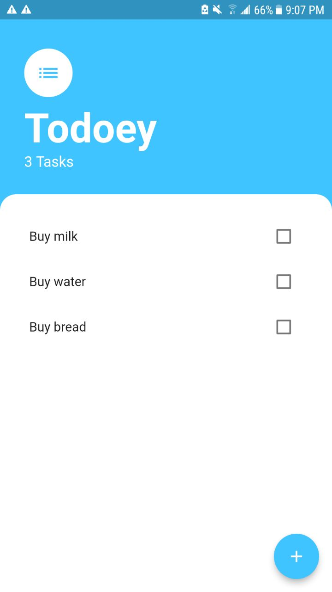
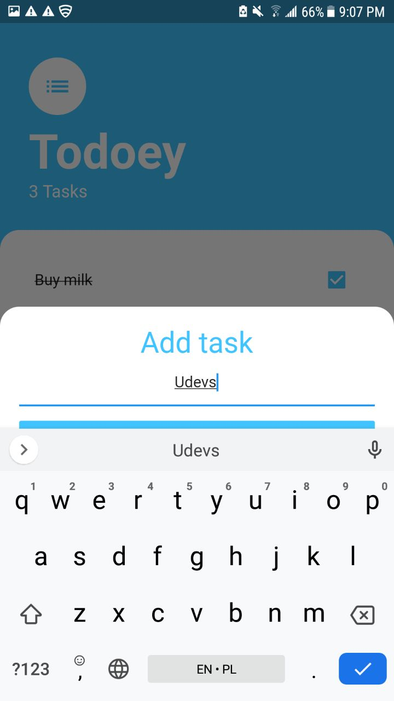

# todoey_flutter

This is app for tracking user daily routine tasks.
User can add new tasks, and once completed then user can tap and cross the tasks or delete the task be long pressing

## Getting Started

This project is a starting point for a Flutter application.

This project has been completed by using state management provider as an example.

A few resources to get you started if this is your first Flutter project:

- [Lab: Write your first Flutter app](https://flutter.dev/docs/get-started/codelab)
- [Cookbook: Useful Flutter samples](https://flutter.dev/docs/cookbook)

